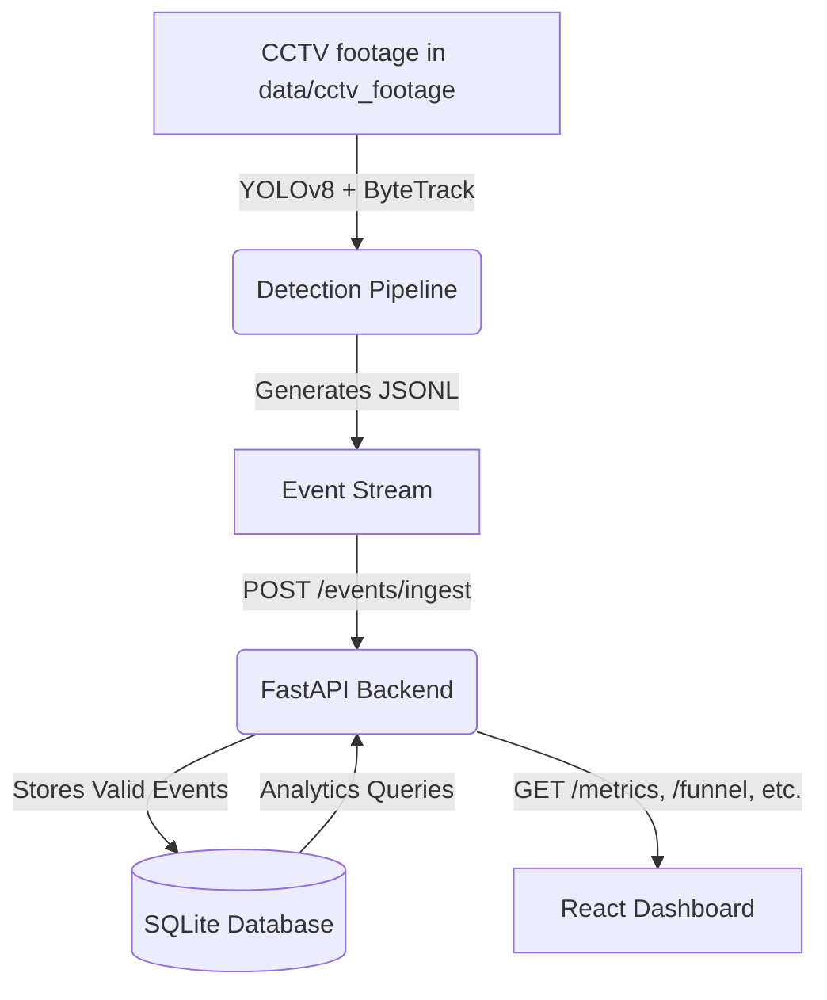

# DESIGN.md

## 1. Problem Understanding
The objective is to build a robust Store Intelligence system that extracts meaningful retail analytics from raw CCTV footage. The system must process video frames, track unique individuals across zones, and emit structured events. These events are ingested by an API to calculate session-based conversion funnels, zone heatmaps, and operational anomalies without crashing on malformed data, proving that it is production-ready.

## 2. System Overview
The system is divided into three major layers:
1. **Detection Pipeline**: Analyzes video, tracks individuals, and pushes structured JSONL events.
2. **Intelligence API**: A FastAPI backend that validates payloads via Pydantic, deduplicates them, and stores them in SQLite. It computes analytics based on visitor sessions rather than raw event counts.
3. **Live Dashboard**: A React frontend that polls the API to visually present the funnel, heatmap, and active anomalies.

## 3. Architecture Diagram

## 4. Detection Pipeline
The pipeline relies on `ultralytics` YOLOv8 for person detection and ByteTrack for short-term identity tracking. A custom geometry module (`pipeline/zones.py`) maps the person's bottom-center bounding box coordinate against the `store_layout.json` polygons. This allows us to deterministically emit `ZONE_ENTER`, `ZONE_EXIT`, and `ZONE_DWELL` events.
The provided MP4 files are kept under `data/cctv_footage/`. Camera IDs are derived from filenames such as `CAM 1.mp4`, and the runnable polygon layout is maintained in `data/store_layout.json` after reviewing the supplied layout workbook in `data/files/`.

## 5. Event Stream Design
Events are strictly structured using a predefined schema (`event_id`, `visitor_id`, `event_type`, `timestamp`, `zone_id`, `dwell_ms`). This enforces a contract between the detection pipeline and the API. Unknown schemas are rejected, but batches process via partial success to ensure the stream isn't completely blocked by a single bad event.

## 6. Intelligence API Design
The API is built on FastAPI. The core philosophy is to offload validation to Pydantic and keep route handlers thin. Analytics logic (e.g., funnel drop-offs, queue spikes) is modularized into separate files (`app/funnel.py`, `app/anomalies.py`) to keep the codebase clean and highly testable.

## 7. Database Design
We use SQLite for simplicity and speed. The primary table is `events`, which acts as an append-only event store. Deduplication is handled natively at the database level by using the `event_id` as a primary key. A separate `pos_transactions` table correlates point-of-sale data with visitor sessions for conversion rate calculations.

## 8. Analytics Logic
Analytics are calculated on a **session** basis, keyed by `visitor_id`.
- **Conversion Rate**: Checks if a visitor was in the billing zone within 5 minutes prior to a POS transaction.
- **POS Matching**: Loads the supplied retail sales CSV from `data/files/`, groups line items into transactions, normalizes the challenge store code (`ST1008`) to `STORE_BLR_002`, and stores matched transactions in `pos_transactions`.
- **Funnel**: Maps the distinct stages (`ENTRY` -> `ZONE_VISIT` -> `BILLING_QUEUE` -> `PURCHASE`).
- **Anomalies**: Continuously evaluates rules, such as `queue_depth >= 10` for a CRITICAL alert or 30 minutes of no activity in a zone for a `DEAD_ZONE` warning.

## 9. Production Readiness
The application is containerized using Docker, includes a `docker-compose.yml` for orchestration, and features extensive Pytest coverage (>70%). The API employs a logging middleware that outputs structured JSON logs (including trace IDs) and uses resilient error handling (no raw stack traces).

## 10. AI-Assisted Decisions

### AI-assisted decision 1: Tracker selection
I asked an LLM to compare DeepSORT, StrongSORT, and ByteTrack for short retail CCTV clips. It suggested DeepSORT for stronger re-identification across occlusions. I chose ByteTrack for the first version because the challenge is time-boxed, ByteTrack is seamlessly integrated with YOLO's Ultralytics package, and it is fast enough for continuous tracking. I added a small re-entry heuristic separately for short-term re-identification across camera edges.

### AI-assisted decision 2: Event Schema vs Session Storage
I discussed with an LLM whether to store raw events or directly construct session objects in the database upon ingestion. The LLM recommended an event-sourcing approach where raw events are stored immutably and sessions are constructed via queries. I chose this approach because it prevents data loss during edge cases (like out-of-order events) and makes replay testing significantly easier.

### AI-assisted decision 3: Anomaly Detection Logic
I asked an LLM to generate standard retail anomaly thresholds. It suggested using Z-scores and standard deviations for traffic drops. Given the 48-hour challenge constraint and the lack of deep historical data in the sample set, I opted for hardcoded heuristic thresholds (e.g., `queue_depth >= 5` for WARN, 30-minute dead zone) to guarantee testability and determinism.

## 11. Limitations and Future Improvements
- **Scalability**: SQLite will lock under heavy concurrent writes if scaled to 40+ stores. Migration to PostgreSQL and Kafka is required for production.
- **Visual Re-ID**: Currently, re-entry relies on a basic time-distance heuristic. Integrating a lightweight Re-ID embedding model (like OSNet) would significantly improve cross-camera tracking.
